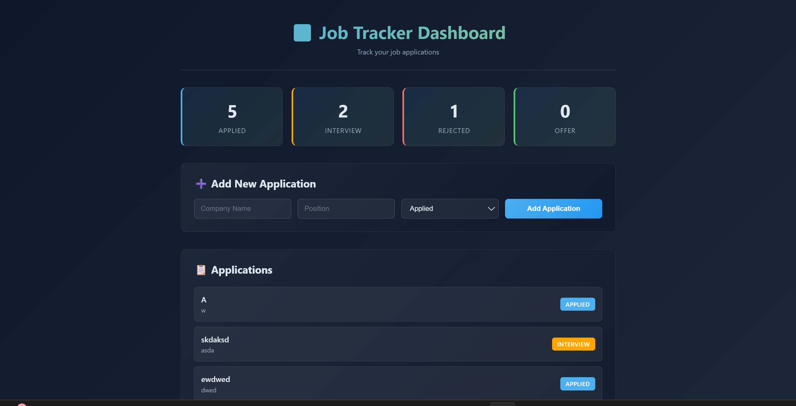

# 🚀 Job Tracker – Fullstack Application

A fullstack job tracking system built with **ASP.NET Core and React**, allowing users to manage applications, track progress and visualize their job search.

---

## 🌐 Live Demo

👉 *(coming soon – Azure deployment in progress)*

---

## 🧠 Overview

This application allows users to:

* Track job applications in one place
* Update application status (Applied, Interview, Rejected, Offer)
* Filter and manage jobs dynamically
* Analyze job progress through structured data
* *(Coming)* Secure authentication with JWT

---

## ⚙️ Tech Stack

**Frontend**

* React
* TypeScript

**Backend**

* ASP.NET Core (.NET)
* Entity Framework

**Database**

* SQL Server *(in progress)*
* In-Memory *(current)*

**Other**

* REST API
* Azure *(deployment in progress)*

---

## 🔥 Key Features

* Built REST API with full CRUD operations
* Implemented dynamic filtering by job status
* Designed scalable backend using ASP.NET Core
* Connected frontend and backend via REST endpoints
* Managed application state using React

---

## 🏗️ Architecture

```text
React (Frontend)
        ↓
ASP.NET Core API
        ↓
Database
```

---

## ▶️ Run Locally

### Backend

```bash
dotnet run
```

### Frontend

```bash
cd jobtracker-frontend
npm install
npm run dev
```

---

## 📸 Screenshots



---

## 🚧 Roadmap

* 🔐 JWT Authentication
* 👤 User-specific data
* 📊 Analytics dashboard
* ☁️ Azure deployment

---

## 👤 Author

**Khalif Cali**
GitHub: https://github.com/KhalifCali
